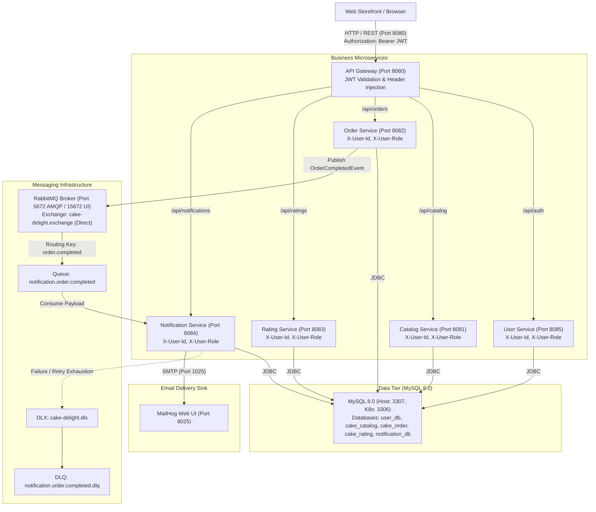
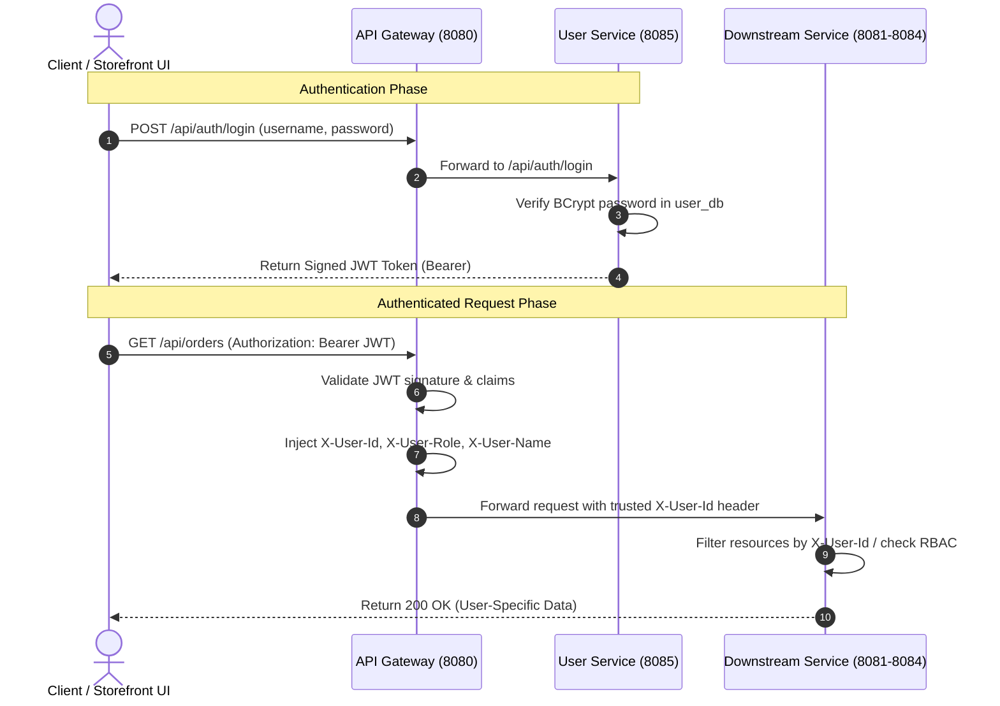
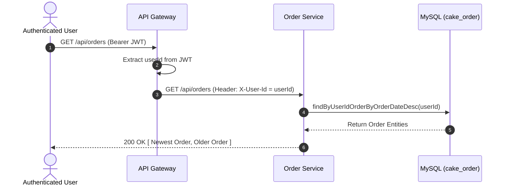
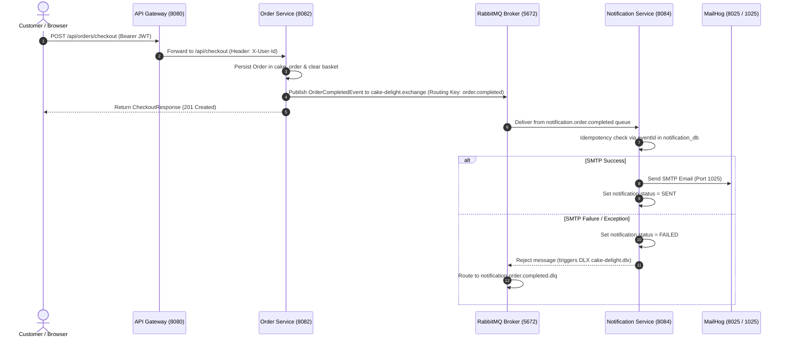
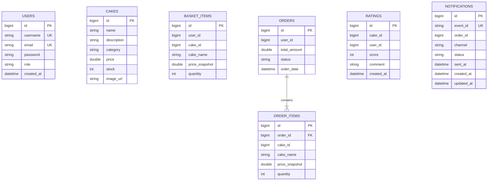

# 🏛️ Cake Delight - Architecture & System Design

This document details the architectural topology, service communication patterns, data storage models, and deployment infrastructure of the **Cake Delight** microservices platform.

---

## 1. Overall System Architecture

Cake Delight is constructed following an **event-driven microservices architecture** pattern. All client requests (Web Storefront UI) enter the platform through a unified **API Gateway**, which validates JWT tokens and routes HTTP traffic to downstream business microservices. Asynchronous operations, such as order completion and email dispatch, are handled via **RabbitMQ** event messaging.

---

## 2. Component Topology & Responsibilities

| Service | Host / K8s Port | Database | Primary Responsibility |
| :--- | :--- | :--- | :--- |
| **API Gateway** | `8080` (NodePort `30080`) | None | Unified entry point, path routing, JWT authentication filter, header injection & static UI hosting. |
| **User Service** | `8085` | `user_db` | Manages user registration, login authentication, BCrypt password hashing, and JWT issuance. |
| **Catalog Service** | `8081` | `cake_catalog` | Manages cake catalog items, pricing, inventory stock, filtering, and RBAC admin mutations. |
| **Order Service** | `8082` | `cake_order` | Shopping basket, checkout processing, user-specific order history (`GET /api/orders`), order details & event publishing. |
| **Rating Service** | `8083` | `cake_rating` | Independent service managing customer cake reviews and aggregate average scores. |
| **Notification Service** | `8084` | `notification_db` | Consumes RabbitMQ order events, records notification audit logs, and dispatches emails via MailHog. |
| **MySQL** | Docker: `3307:3306` K8s: `3306` | Shared Instance | Relational storage hosting 5 isolated databases (`cake_catalog`, `cake_order`, `cake_rating`, `notification_db`, `user_db`). |
| **RabbitMQ** | `5672` (AMQP) `15672` (Web UI) | In-Memory / Disk | Asynchronous message broker handling direct exchanges (`cake-delight.exchange`), queues (`notification.order.completed`), and DLQ (`notification.order.completed.dlq`). |
| **MailHog** | `1025` (SMTP) `8025` (Web UI) | In-Memory | Local SMTP sink for receiving, inspecting, and debugging notification emails. |

---

## 3. Communication & Security Patterns

### A. JWT Authentication & Identity Propagation Flow
- The **API Gateway** serves as the security boundary for the entire microservice ecosystem.
- Client requests present `Authorization: Bearer <JWT>`.
- `JwtAuthenticationFilter` validates token signature and expiration against the shared `JWT_SECRET`.
- The Gateway strips unverified incoming identity headers and injects trusted downstream headers (`X-User-Id`, `X-User-Name`, `X-User-Role`).

### B. User Order History Flow
- Endpoint: `GET /api/orders`
- Client sends `Authorization: Bearer <token>` without providing `userId` as a query parameter.
- API Gateway validates the JWT token and forwards `X-User-Id: <userId>` to `order-service`.
- `order-service` executes `orderRepository.findByUserIdOrderByOrderDateDesc(userId)` against `cake_order`.
- Returns user-specific order list sorted newest first.
- Individual order lookup (`GET /api/orders/{id}`) checks `order.getUserId().equals(userId)` or `ROLE_ADMIN`; returns `403 Forbidden` if requested by another user.

### C. Asynchronous Event Messaging & DLQ Flow
- **Producer**: `order-service`
- **Exchange**: `cake-delight.exchange` (**Direct Exchange**)
- **Routing Key**: `order.completed`
- **Primary Queue**: `notification.order.completed`
- **Consumer**: `notification-service` (`OrderCompletedListener`)
- **Dead Letter Exchange (DLX)**: `cake-delight.dlx`
- **Dead Letter Queue (DLQ)**: `notification.order.completed.dlq`

---

## 4. Database Schema & Data Isolation

Each microservice maintains strict database isolation within the shared MySQL server container:

---

## 5. Deployment Topologies

### Docker Compose View
All **9 containers** run within a single isolated bridge network `cake-network`. Service discovery relies on Docker container names (`api-gateway`, `user-service`, `catalog-service`, `order-service`, `rating-service`, `notification-service`, `cake-mysql`, `rabbitmq`, `mailhog`).
- **MySQL Host Port Mapping**: `3307:3306`
- **RabbitMQ Host Port Mappings**: AMQP `5672:5672`, Management UI `15672:15672`
- **MailHog Host Port Mappings**: SMTP `1025:1025`, Web UI `8025:8025`

### Kubernetes View
Deployed in namespace `cake-delight`:
- **Workload Summary**: 9 Deployments / Services, 11 Pods total.
- **Multi-Replica Deployments**:
  - `api-gateway`: **2 Replicas** (NodePort `30080` -> Target `8080`)
  - `user-service`: **2 Replicas** (ClusterIP `8085`)
- **Single-Replica Deployments**: `catalog-service`, `order-service`, `rating-service`, `notification-service`, `mysql`, `rabbitmq`, `mailhog` (**1 Replica each**).
- **Config & Secrets**: Managed globally via `cake-delight-config` ConfigMap and `cake-delight-secrets` Secret.
