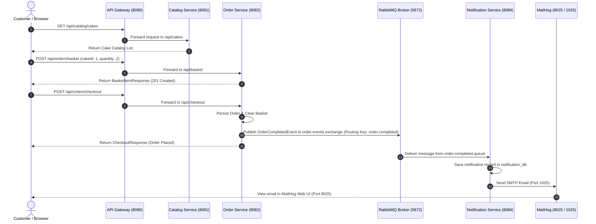
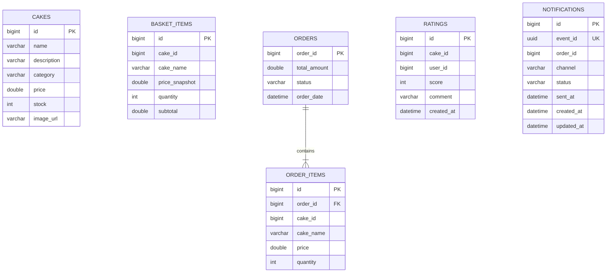

# 🏛️ Cake Delight - Architecture & System Design

This document details the architectural topology, service communication patterns, data storage models, and deployment infrastructure of the **Cake Delight** microservices platform.

---

## 1. Overall System Architecture

Cake Delight is constructed following an **event-driven microservices architecture** pattern. All client requests (Web Storefront UI) enter the platform through a unified **API Gateway**, which routes HTTP traffic to downstream business microservices. Asynchronous operations, such as order completion and email dispatch, are handled via **RabbitMQ** event messaging.

```mermaid
flowchart TD
    Client["Web Storefront / Client (Browser)"] -->|HTTP / REST (Port 8080)| Gateway["API Gateway (Spring Cloud Gateway)"]

    subgraph Business Microservices
        Gateway -->|/api/catalog/**| Catalog["Catalog Service (Port 8081)"]
        Gateway -->|/api/orders/**| Order["Order Service (Port 8082)"]
        Gateway -->|/api/ratings/**| Rating["Rating Service (Port 8083)"]
        Gateway -->|/api/notifications/**| Notification["Notification Service (Port 8084)"]
    end

    subgraph Data Tier
        Catalog -->|JDBC| MySQL[("MySQL 8.0 (Host: 3307, K8s: 3306)<br/>- cake_catalog<br/>- cake_order<br/>- cake_rating<br/>- notification_db")]
        Order -->|JDBC| MySQL
        Rating -->|JDBC| MySQL
        Notification -->|JDBC| MySQL
    end

    subgraph Event & Messaging Infrastructure
        Order -->|Publish OrderCompletedEvent| RabbitMQ["RabbitMQ (Port 5672 AMQP / 15672 UI)<br/>Exchange: order.events.exchange"]
        RabbitMQ -->|Consume order.completed.queue| Notification
    end

    subgraph Email Delivery Sink
        Notification -->|SMTP (Port 1025)| MailHog["MailHog (Port 8025 Web UI)"]
    end
```

---

## 2. Component Topology & Responsibilities

| Service | Host / K8s Port | Database | Primary Responsibility |
| :--- | :--- | :--- | :--- |
| **API Gateway** | `8080` (NodePort `30080`) | None | Unified reverse-proxy entry point, request path routing, static UI hosting. |
| **Catalog Service** | `8081` | `cake_catalog` | Manages cake catalog items, pricing, inventory stock, and filtering by category/name/price. |
| **Order Service** | `8082` | `cake_order` | Manages shopping basket items, checkout processing, order records, and AMQP event publishing. |
| **Rating Service** | `8083` | `cake_rating` | Independent service managing customer cake reviews and aggregate average scores. |
| **Notification Service** | `8084` | `notification_db` | Consumes RabbitMQ order events, records notification audit logs, and sends emails via MailHog. |
| **MySQL** | Docker: `3307:3306`<br/>K8s: `3306` | Shared Instance | Relational storage hosting 4 isolated databases (`cake_catalog`, `cake_order`, `cake_rating`, `notification_db`). |
| **RabbitMQ** | `5672` (AMQP)<br/>`15672` (Web UI) | In-Memory / Disk | Asynchronous message broker handling topic exchanges (`order.events.exchange`) and durable queues (`order.completed.queue`). |
| **MailHog** | `1025` (SMTP)<br/>`8025` (Web UI) | In-Memory | Local SMTP sink for receiving, inspecting, and debugging notification emails. |

---

## 3. Communication Patterns

### A. UI to Backend Routing
- The SPA Web Storefront static assets (`index.html`) are served directly by the **API Gateway** at `http://localhost:8080/`.
- All API requests from the frontend use relative paths starting with `/api/`.
- Spring Cloud Gateway filters rewrite routes dynamically:
  - `/api/catalog/**` -> rewritten & forwarded to `http://catalog-service:8081/api/cakes/**`
  - `/api/orders/basket` -> rewritten & forwarded to `http://order-service:8082/api/basket`
  - `/api/orders/checkout` -> rewritten & forwarded to `http://order-service:8082/api/checkout`
  - `/api/ratings/**` -> rewritten & forwarded to `http://rating-service:8083/api/ratings/**`
  - `/api/notifications/**` -> forwarded to `http://notification-service:8084/api/notifications/**`

### B. Asynchronous Event Messaging
- **Producer**: `order-service`
- **Exchange**: `order.events.exchange` (Topic Exchange)
- **Routing Key**: `order.completed`
- **Queue**: `order.completed.queue`
- **Consumer**: `notification-service` (`OrderCompletedListener`)

When checkout is executed, `order-service` saves the order state to `cake_order.orders`, clears the basket, and broadcasts `OrderCompletedEvent` to RabbitMQ. `notification-service` consumes the payload asynchronously from `order.completed.queue` without blocking the checkout HTTP response.

### C. Rating Service Independence
- `rating-service` manages cake reviews and average ratings independently on its own database `cake_rating`.
- There is no direct HTTP, Feign client, or database coupling between `catalog-service` and `rating-service`. Frontend clients fetch catalog details from `catalog-service` and rating summary data from `rating-service` via API Gateway.

---

## 4. End-to-End Order & Notification Flow



---

## 5. Database Schema & Data Isolation

Each microservice maintains strict database isolation within the shared MySQL server container:



---

## 6. Deployment Topologies

### Docker Compose View
All 8 containers run within a single isolated bridge network `cake-network`. Service discovery relies on Docker container names (`catalog-service`, `order-service`, `rating-service`, `notification-service`, `cake-mysql`, `rabbitmq`, `mailhog`).
- **MySQL Host Port Mapping**: `3307:3306`
- **RabbitMQ Host Port Mappings**: AMQP `5672:5672`, Management UI `15672:15672`
- **MailHog Host Port Mappings**: SMTP `1025:1025`, Web UI `8025:8025`

### Kubernetes View
Deployed in namespace `cake-delight`:
- **API Gateway**: Deployed as a `NodePort` service mapping node port `30080` to target port `8080`.
- **Microservices & Infrastructure**: Deployed as individual `Deployment` resources paired with `ClusterIP` `Service` definitions (`mysql:3306`, `rabbitmq:5672`, `mailhog:1025/8025`).
- **Config & Secrets**: Managed globally via `cake-delight-config` ConfigMap and `cake-delight-secrets` Secret.
